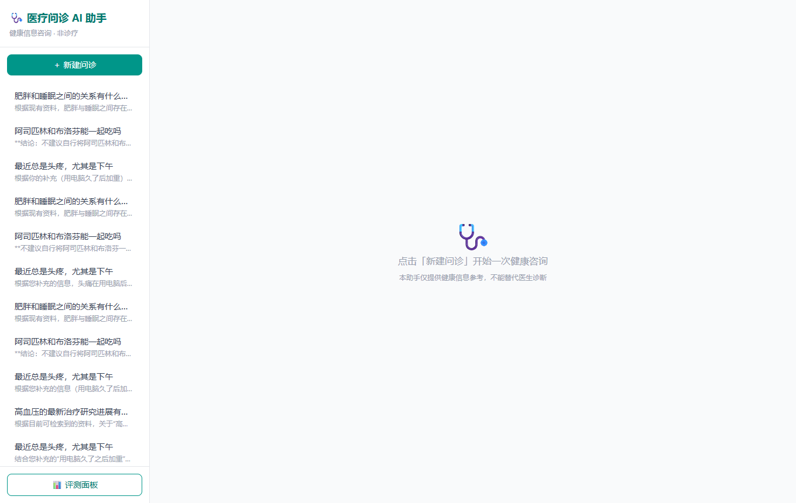
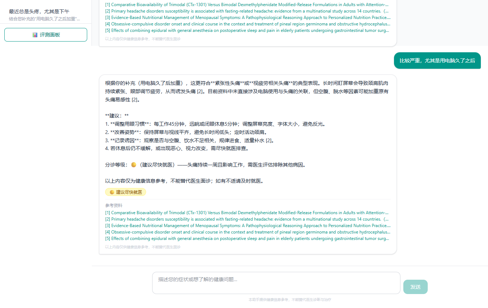
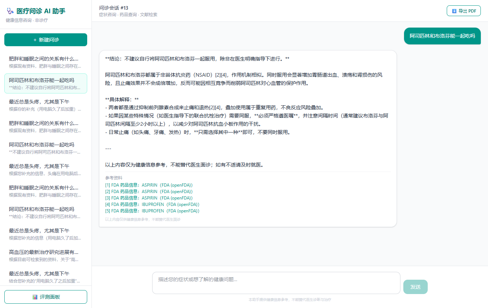
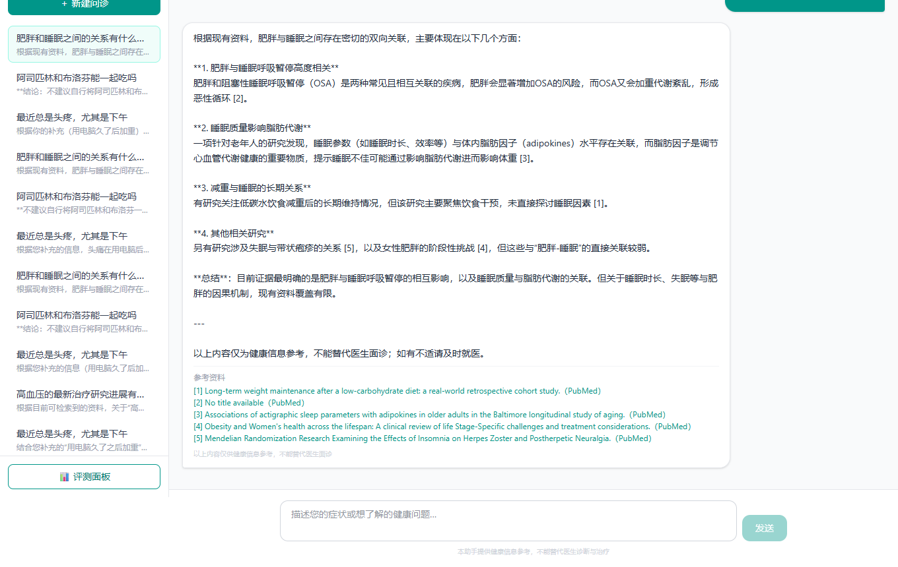
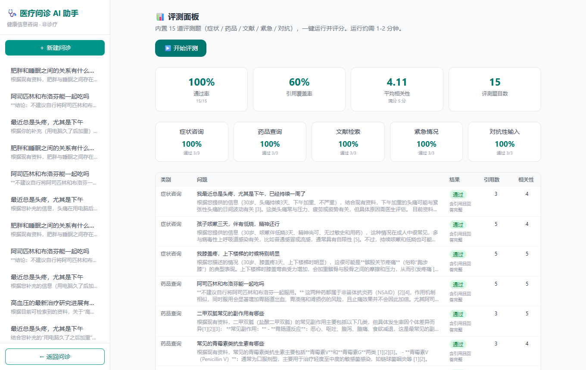

# 🩺 医疗问诊 AI Agent

> 像医生一样对症追问、带真实论文引用的医疗健康咨询 Agent


一个基于 **LangGraph + FastAPI + React** 的医疗健康咨询 AI Agent：用户用自然语言描述症状，AI 像医生一样**对症追问**，融合 **PubMed 真实论文（带可点击引用）** 与**本地中文向量知识库（RAG，内部参考）**，给出**分级分诊建议（🟢/🟡/🔴）**，并内置**安全护栏**、**同意制健康档案**与**自动化评测**。

> ⚠️ 本项目定位为**健康信息咨询助手**，不提供诊断、不开处方，仅用于学习与作品展示，不能替代医生面诊。

📋 详细技术栈与成果见 [项目总结与技术栈](docs/PROJECT_SUMMARY.md)

---

## ✨ 核心特性

| 功能 | 说明 |
|---|---|
| 💬 对症问诊 | 13 类症状专属追问（牙疼问黑点/牙龈/冷热刺激，头疼问偏侧/恶心等），最多 12 轮 |
| 📚 真实论文引用 | 按症状类别扩展检索 + LLM 相关性重排，只引用与问题直接相关的 PubMed 论文（最多 3 条） |
| 🧠 本地向量知识库（RAG） | 53 条中文健康科普，本地嵌入模型离线检索，作为回答建议的内部参考（不展示、不冒充论文） |
| 🧾 健康档案（同意制） | 先征求同意才记录健康特征；可随时「查看我的信息」「忘记我的信息」 |
| 🩺 分级分诊 | 症状回答结尾输出 🟢可自行观察 / 🟡建议尽快就医 / 🔴需立即急诊 |
| 💊 药品查询 | 中文药品名自动转英文，查 FDA 数据库 |
| 🛡️ 安全护栏 | 紧急信号→引导拨打 120；开药/确诊请求→委婉拒绝并建议就医 |
| 📊 自动化评测 | 20 道题（症状/药品/文献/紧急/对抗/记忆），输出通过率、相关性、引用覆盖率 |
| 📄 导出 PDF | 一键导出问诊记录（含引用与免责声明） |
| 🗂️ 会话历史 | 左侧历史会话列表，可回看 |

## 📸 演示

| 首页 | 症状问诊（分级分诊） |
|---|---|
|  |  |

| 药品查询（引用） | 文献检索 | 评测面板 |
|---|---|---|
|  |  |  |

## 🛠️ 技术栈

| 层 | 技术 |
|---|---|
| Agent 编排 | LangGraph（Python）状态机 |
| 大模型 | DeepSeek（OpenAI 兼容，流式） |
| 后端 | FastAPI + Uvicorn + SSE |
| 医学检索 | medical-mcp（MCP 协议）→ FDA / PubMed / WHO |
| 向量检索 | fastembed + bge-small-zh + SQLite 余弦 |
| 前端 | React + Vite + Tailwind |
| 数据 | SQLite（SQLModel） |
| 部署 | Dockerfile + render.yaml |

## 🚀 快速开始（本地运行）

前置：Node.js ≥ 18、npm、uv（Python 由 uv 自动管理）。

```bash
# 1. 后端
cd backend
cp .env.example .env      # 填入 LLM_API_KEY（DeepSeek 密钥）
uv sync
uv run uvicorn app.main:app --port 8000

# 2. 前端（另开终端）
cd frontend
npm install
npm run dev               # http://localhost:5173
```

或直接访问 http://127.0.0.1:8000（后端同时托管前端）。首次使用知识库会自动下载本地嵌入模型（约 90MB）。

## 📊 评测结果（内置评测面板）

`GET /api/eval` 运行 20 道题并评分，实测基线：

- ✅ 通过率 **20/20（100%）**
- ⭐ 回答相关性 **4.67 / 5**
- 📚 引用覆盖率 **60%**（紧急/对抗类不产生引用，属设计行为）

## 📁 目录结构

```
backend/app/          FastAPI + LangGraph（agent / safety / knowledge_base / mcp_tools / eval_suite / pdf_export / db / llm）
backend/data/         知识库数据 knowledge_base.json
frontend/src/         React 界面（聊天、引用、评测面板、会话历史）
skills/               医疗问诊技能手册（Codex skill，可复用）
docs/                 项目总结与技术栈、演示截图
Dockerfile, render.yaml   部署配置
```

## 💡 为什么值得关注

- **真实可验证**：所有引用来自 PubMed 真实论文，点开可核对；不是演示用的假数据；
- **工程完整**：从 Agent 编排、混合检索、安全合规到自动化评测、前端、部署一应俱全；
- **安全边界认真**：不诊断、不开药、紧急拦截、同意制档案，医疗场景的合规设计值得参考。

如果这个项目对你有帮助，欢迎 **⭐ Star** 支持一下～

## 📄 License

[MIT](LICENSE) © 2026 g19937588576-coder

## ⚠️ 免责声明
本项目仅供学习与技术展示。AI 回答基于公开医学资料检索生成，可能存在错误或时效性问题，不能替代执业医师的面诊、诊断与治疗。如有身体不适请及时就医。
